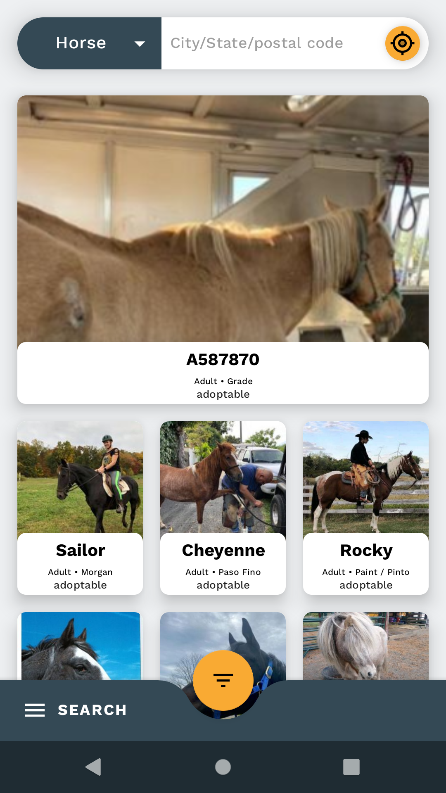
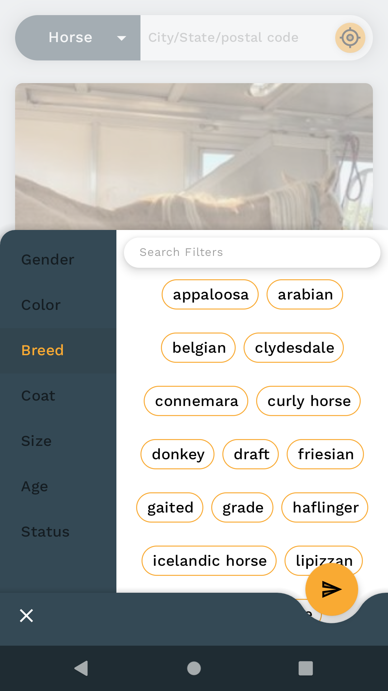
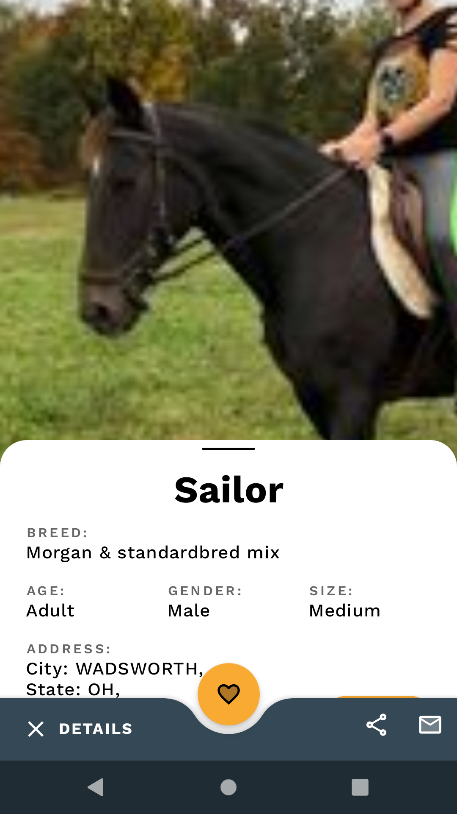
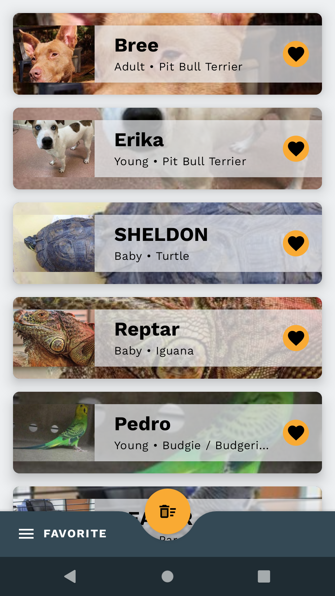

# PetPot

PetPot is a pet search engine (Powered By Petfinder) which help pet lovers to search and find the pets meeting their requirements.
Provide feature to manage there favouite list, read pet bio and contact respective shelter to adopt pet. Intent of app is to find home for homeless pets<br/>

<a href="https://play.google.com/store/apps/details?id=com.droid47.petpot.free">
    
</a>
</div>
</br></br>

## Screenshots
<div style="display:flex;" >




</div>

### Tech/Libraries

* <a href="https://material.io/develop/android">Material Components/Design</a>
* <a href="https://developer.android.com/kotlin#:~:text=Kotlin%20is%20a%20modern%20statically,developer%20satisfaction%2C%20and%20code%20safety">kotlin Android</a>
* <a href="https://developer.android.com/topic/libraries/architecture">Architecture Component</a>
* <a href="https://developer.android.com/guide/navigation/navigation-getting-started">Navigation Component</a>
* <a href="https://dagger.dev/">Dagger2</a>
* <a href="https://bumptech.github.io/glide/">Glide</a>
* <a href="https://github.com/airbnb/lottie-android">Lottie</a>
* <a href="https://github.com/ReactiveX/RxAndroid">Rxjava2</a>
* <a href="https://square.github.io/retrofit/">Retrofit</a>


## License

```
Copyright 2020 Ravikiran Surpur.

Licensed to the Apache Software Foundation (ASF) under one or more contributor
license agreements. See the NOTICE file distributed with this work for
additional information regarding copyright ownership. The ASF licenses this
file to you under the Apache License, Version 2.0 (the "License"); you may not
use this file except in compliance with the License. You may obtain a copy of
the License at

http://www.apache.org/licenses/LICENSE-2.0

Unless required by applicable law or agreed to in writing, software
distributed under the License is distributed on an "AS IS" BASIS, WITHOUT
WARRANTIES OR CONDITIONS OF ANY KIND, either express or implied. See the
License for the specific language governing permissions and limitations under
the License.
```